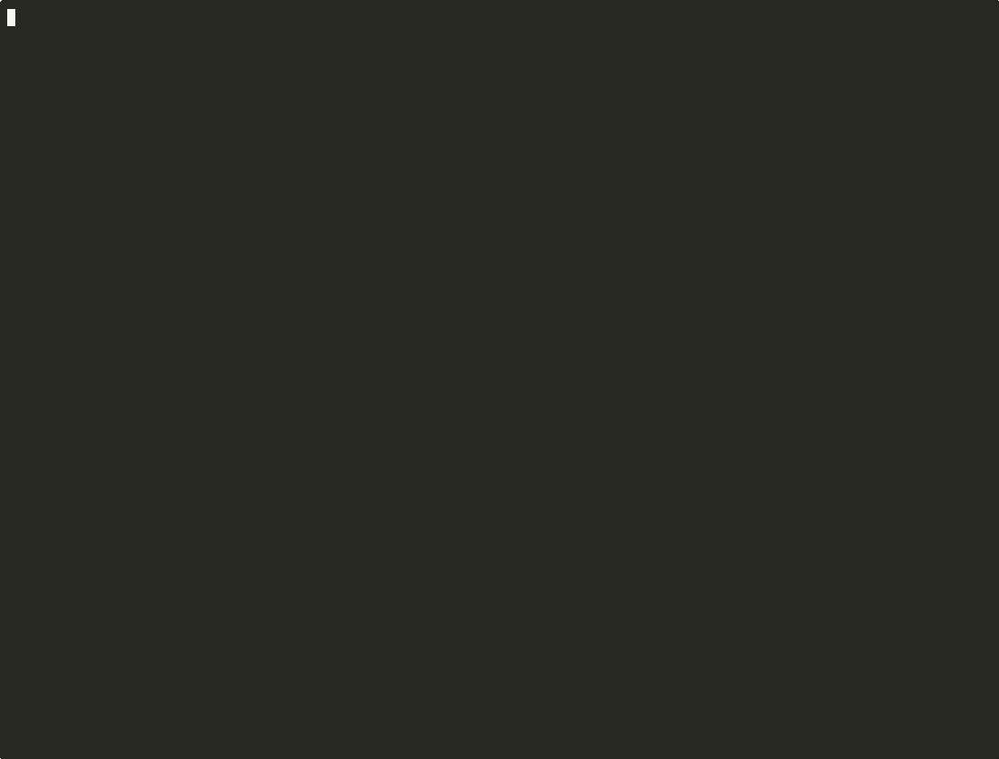

# Claude Skill Manager (csm)

Manage [Claude Code](https://claude.ai/claude-code) skills across projects from a single place.

## The Problem

Claude Code requires skills to live **flat** inside each project's `.claude/skills/` directory. If you have a library of skills organized in subdirectories, or skills shared across multiple projects, you have to copy them manually into every project — and keep them in sync.

```
# What you have (organized by topic):
~/skills-library/
  data-analysis/
    backtest/SKILL.md
    fetch-data/SKILL.md
  productivity/
    meeting-prep/SKILL.md

# What Claude Code needs (flat, per project):
~/project-a/.claude/skills/backtest/SKILL.md
~/project-a/.claude/skills/fetch-data/SKILL.md
~/project-b/.claude/skills/meeting-prep/SKILL.md
```

**csm** solves this by creating symlinks from your organized skill library into each project's `.claude/skills/` directory. You maintain skills in one place, and deploy them anywhere.

## Agent-Friendly by Design

csm is built to be used by both humans and LLM agents:

- **`csm schema`** outputs a complete JSON document describing all commands, concepts, config format, and keybindings — designed to be injected into an agent's context
- **`--json`** flag on every query command for structured, parseable output
- **Errors are always JSON** on stderr (even without `--json`), following the same structured format as [GWS](https://github.com/googleworkspace/cli)
- **No interactive prompts** in JSON mode — agents can script `csm` safely

An agent can bootstrap itself with:

```bash
csm schema | head -c 4000  # inject into system prompt
csm --json sources          # discover what's available
csm --json targets          # discover where to deploy
csm install my-skill --to my-project  # deploy
```

## Core Concept

csm connects **sources** (where skills live) to **targets** (where Claude Code looks for them):

| | Description | Example |
|---|---|---|
| **Source** | A directory containing skills (`SKILL.md`) or a Claude Code marketplace | `~/skills-library`, `~/code/my-org/*` |
| **Target** | A project with a `.claude/` directory | `~`, `~/code/my-project` |
| **Install** | A skill deployed from a source into a target | symlink or `claude plugin install` |

## Demo



## Installation

### With Homebrew (macOS)

```bash
brew install aclemen1/tap/claude-skill-manager
```

### With uv (any platform)

```bash
uv tool install claude-skill-manager
```

### With pip

```bash
pip install claude-skill-manager
```

## Quick Start

```bash
# 1. Create a config file
csm init

# 2. Edit config to add your source and target paths
cat ~/.config/claude-skill-manager/csm.toml
```

Example `csm.toml` :

```toml
source_paths = ["~/code/my-org/*", "~/skills-library"]
target_paths = ["~", "~/code/my-org/*"]
```

Paths support glob patterns:
- `~` — exact (home directory only)
- `~/code/*` — direct children
- `~/vaults/**` — recursive
- `~/code/*/backend` — pattern matching

```bash
# 3. Explore what's available
csm sources          # list all discovered skills
csm targets          # list all projects with .claude/
csm list             # unified inventory with install state

# 4. Install a skill
csm install my-skill --to my-project

# 5. Or use the interactive TUI (or just: csm)
csm
```

## CLI Commands

| Command | Description |
|---------|-------------|
| `csm` | Launch the interactive TUI (default when no subcommand) |
| `csm sources` | List all discovered sources (local skills, marketplace plugins) |
| `csm targets` | List all targets with install counts |
| `csm installs` | List all current installs (symlinks, plugins, orphans) |
| `csm install SKILL --to TARGET` | Install a local skill into a target via symlink |
| `csm uninstall TARGET` | Remove skill symlinks from a target |
| `csm list` | Unified inventory with install state per item |
| `csm diagnostics` | Detect per-target name collisions and issues |
| `csm updates` | Detect stale plugin cache |
| `csm init` | Create a default config file |
| `csm schema` | Output JSON schema for LLM/agent consumption |

### JSON output

All query commands support `--json` for machine-readable output:

```bash
csm --json sources    # JSON array of sources with items
csm --json targets    # JSON array of targets with counts
csm --json installs   # JSON array of all installs
csm --json list       # JSON inventory with install state
csm --json diagnostics --all  # JSON diagnostics
```

Errors are always returned as structured JSON on stderr:

```json
{
  "error": {
    "code": 1,
    "message": "No items matched 'nonexistent'.",
    "reason": "notFound"
  }
}
```

### LLM/Agent integration

```bash
csm schema  # outputs full JSON documentation for LLM consumption
```

The `schema` command outputs a structured JSON document with all commands, concepts, config format, diagnostic types, and TUI keybindings — designed to be injected into an LLM context for tool use.

## TUI Keybindings

### Navigation

| Key | Action |
|-----|--------|
| `j` / `k` | Move down / up |
| `Enter` | Expand / collapse (fold) |
| `l` | Expand |
| `h` | Collapse, or go to parent |
| `L` | Expand all under cursor |
| `H` | Collapse all under cursor |
| `Tab` / `Shift+Tab` | Cycle panels |

### Selection and Install

| Key | Action |
|-----|--------|
| `Space` | Select (switch to toggle mode on other panel) |
| `x` | Toggle install / uninstall |
| `a` | Apply pending changes |
| `d` | Delete selected pending change |
| `Esc` | Cancel all pending changes |

### Modals and Actions

| Key | Action |
|-----|--------|
| `s` | Settings editor |
| `D` | Diagnostics (conflicts + stale cache) |
| `?` | Help |
| `Ctrl+P` | Command palette (change theme, etc.) |
| `r` | Refresh (rescan all sources) |
| `q` | Quit |

Theme selection previews each theme in real time as you navigate the list. The chosen theme is persisted in `csm.toml`.

## Diagnostics

csm detects issues **per target** — two skills with the same name only conflict if they're both active in the same project:

| Type | Severity | Description |
|------|----------|-------------|
| `user-user` | ERROR | Two local skills with the same name in the same target |
| `user-plugin` | WARNING | A local skill shadows a Claude Code plugin |
| `orphan-plugin` | WARNING | An unmanaged skill copy coexists with a plugin |
| `cross-marketplace` | WARNING | Same skill name from different marketplaces |
| `mp-cache` | INFO | Normal: marketplace catalog and installed cache |

## Configuration

Config file: `~/.config/claude-skill-manager/csm.toml`

```toml
# Enable Claude Code marketplace plugin discovery (default: true)
plugins = true

# Glob patterns for skill source directories
# Each resolved directory is scanned for */SKILL.md
source_paths = [
    "~/skills-library",
    "~/code/my-org/*",
]

# Glob patterns for target directories
# Each resolved directory is checked for .claude/ presence
target_paths = [
    "~",
    "~/code/my-org/*",
]

# Theme preference (set via Ctrl+P in TUI)
# theme = "monokai"
```

## How it works

### The flat deployment problem

Claude Code scans `.claude/skills/` for skill directories, each containing a `SKILL.md`. It expects a **flat** structure — no nesting:

```
my-project/.claude/skills/
  backtest/SKILL.md       ← Claude Code sees this
  fetch-data/SKILL.md     ← and this
```

But as a developer, you want to **organize** your skills by topic, team, or library:

```
~/skills-library/
  data-analysis/backtest/SKILL.md
  data-analysis/fetch-data/SKILL.md
  productivity/meeting-prep/SKILL.md
```

### Symlink-based deployment (managed by csm)

csm bridges the gap with **symlinks**. When you install a skill into a target, csm creates a symlink in the target's `.claude/skills/` directory pointing back to the source:

```
~/project-a/.claude/skills/
  backtest → ~/skills-library/data-analysis/backtest
  fetch-data → ~/skills-library/data-analysis/fetch-data
```

The skill lives in one place (the source library), but is visible to Claude Code in every project where it's installed. Edit the skill once, every project picks it up.

### Marketplace plugins (managed by Claude Code)

For Claude Code marketplace plugins, csm provides a **unified view** of all installed plugins across all your projects and scopes (user/project). Install and uninstall operations are delegated to the `claude plugin` CLI. The toggle operates at the **plugin level** (not individual skills), since Claude Code installs entire plugins.

### Orphans

Skills found in `.claude/skills/` that are neither symlinks to known sources nor installed via plugins are flagged as **orphans** (shown with `?` in the TUI). These are typically skills that were copied manually. csm shows them for awareness but doesn't manage them.

## Development

```bash
# Clone and install
git clone https://github.com/aclemen1/claude-skill-manager.git
cd claude-skill-manager
uv sync

# Run tests
uv run pytest

# Run the TUI locally
uv run csm

# Run with coverage
uv run pytest --cov=skill_manager
```

## License

MIT
